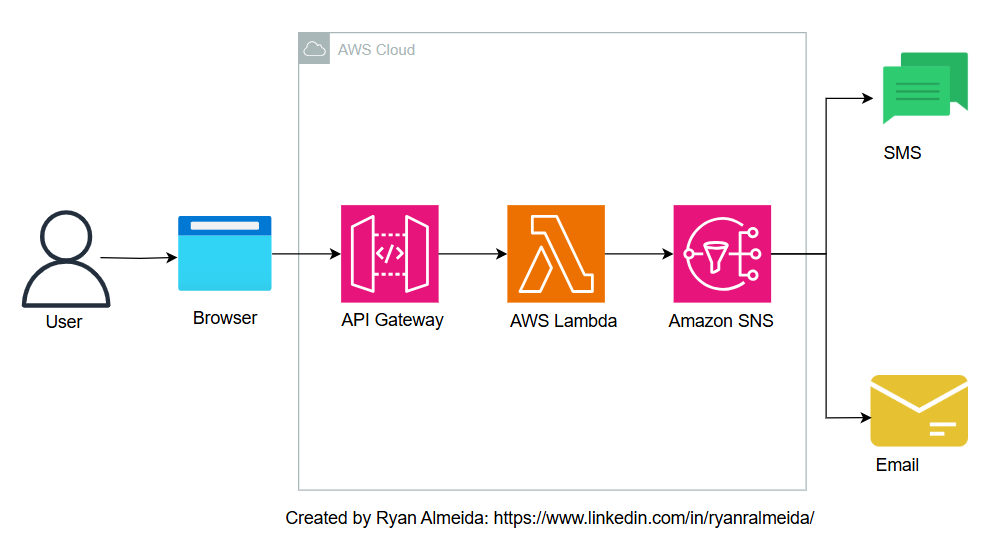

# Build a Todo Web Notification Service 
## Project Description:
This project creates a notification system where users select a notification type (SMS or email) and input a message. Recipients' contact information is predefined in the backend using Amazon SNS. The project is a great introduction to learn, build and deploy simple APIs (API Gateway) and to integrate them with other AWS services such as AWS Lambda, and SNS.

I created this project as a hobby project for 2 reasons:
- As a Solutions Architect at work, I noticed several architectures that employed an "API Gateway + AWS Lambda" combination. The Lambda was usually used as an authorizer to validate user credentials and API Gateway was used as an entry point into the application
- I often recalled many to-do items thorougout my work day (related not only to work, but also my personal life - bring groceries, learn git, pay bills, etc) that I thought of creating a simple way to log them. The traditional todo apps were too overwhelming for me. So I created this application as a way to receive texts on my phone, which I could review at the end of the day.

## Architecture Diagram:

   
## Components Description:
| Component   | Functionality                                                                                          |
| ----------- | ------------------------------------------------------------------------------------------------------ |
| API Gateway | Exposes an HTTP API endpoint for receiving notification requests.                                      |
| AWS Lambda  | Processes incoming requests and publishes messages to Amazon SNS. The Lambda code is written in Python |
| Amazon SNS  | Sends the message (from user input in frontend) as a notification via SMS or Email                     |
| Browser     | Displays the frontend to the user in order to submit a message.                                        |

## Steps to Deploy:
1. [Configure Amazon SNS](sns_instructions.md)
2. [Create the Lambda Function](lambda_instructions.md)
3. [Configure API Gateway](api_instructions.md)
4. [Build and Deploy the Frontend](frontend_instructions.md)
   
## Learning Outcomes:
This is a great introductory project to learn basic web API development and implementation. APIs act as intermediaries that allow web applications to exchange data with servers, databases, or third-party services. In this project, API Gateway acts as an intermediary between the frontend (the input from the user) and the backend logic (the Lambda function that processes this logic and sends it to another dowwnstream process - Amazon SNS). This project also helps you learn the basics of other commonly used AWS services, such as Lambda and SNS. In summary, you can a good introduction to the following:

### API Gateway:

- Learn to expose backend logic using HTTP APIs.
- Understand routing and Lambda integration.

### AWS Lambda:

- Develop serverless functions for event-driven applications.
- Use the Boto3 library to interact with AWS services programmatically.

### Amazon SNS:

- Explore the power of SNS for notifications.
- Configure multi-protocol subscriptions and manage topic-based communication.

### Basic Web Development:

- Integrate a simple frontend with an AWS-powered backend.
- Handle real-world scenarios like predefined recipients and input validation.